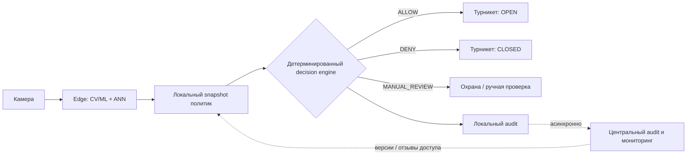

# Система контроля доступа с распознаванием лиц


CV/ML-система для офисного кампуса: от события камеры до решения `ALLOW` / `DENY` / `MANUAL_REVIEW`, команды турникету и журнала аудита. Решение спроектировано для 12 000 сотрудников, трёх проходных и пикового потока до 20 проходов/мин на проходную.

> **Инвариант безопасности:** неопределённая личность, подозрение на spoofing, отозванный доступ или устаревшая политика никогда не приводят к автоматическому открытию турникета.

## Что демонстрирует PoC

PoC намеренно небольшой: CV-сигналы и результат ANN-поиска смоделированы, а **логика принятия решения, fail-safe правила, аудит и идемпотентность команды турникету реализованы в коде и покрыты тестами**.

| Сценарий | Решение | Турникет | Следующее действие |
|---|---|---|---|
| `happy` | `ALLOW` | `OPEN` | открыть турникет |
| `risky` — два близких кандидата | `MANUAL_REVIEW` | `CLOSED` | ручная проверка |
| `spoof` | `DENY` | `CLOSED` | разбор службой безопасности |
| `offline` + устаревшая политика | `MANUAL_REVIEW` | `CLOSED` | безопасный резервный сценарий |
| `revoked` | `DENY` | `CLOSED` | отказ в доступе |
| `low_quality` | `DENY` | `CLOSED` | повторный кадр или карта |

### Проверяемость ключевых требований

| Требование | Реализация | Проверка |
|---|---|---|
| Happy path открывает турникет | `app/decision.py`, `app/demo.py` | `tests/test_demo.py` |
| Неоднозначный матч не открывает доступ | `MANUAL_REVIEW → CLOSED` | `tests/test_demo.py` |
| Spoof / stale policy / revoked / model или ANN unavailable безопасно закрываются | fail-safe ветки decision engine | `tests/test_safety.py` |
| Повтор команды не открывает турникет второй раз | dedup по `command_id` | `tests/test_idempotency.py` |
| Причина решения попадает в audit trail | JSONL audit record | `tests/test_audit.py` |
| Экономика воспроизводима | `scripts/economics.py` | `tests/test_economics.py` |
| Safety сохраняется под конкурентной нагрузкой | `scripts/load_smoke.py` | `tests/test_load_smoke.py`, `docs/load-test.md` |
| Web-MVP не дублирует decision logic | `web_app.py` вызывает `run_demo` | ручной smoke + общий `verify.py` |

## Запуск за минуту

Требуется **Python 3.10+**. CI проверяет проект на Python 3.10 и 3.13.

```bash
python -m venv .venv
# Windows PowerShell: .venv\Scripts\Activate.ps1
# macOS/Linux: source .venv/bin/activate
python -m pip install -r requirements-dev.txt
python scripts/verify.py
```

Отдельные demo-сценарии:

```bash
python -m app.demo --scenario happy
python -m app.demo --scenario risky
python -m app.demo --scenario spoof
python -m app.demo --scenario offline
python -m app.demo --scenario revoked
python -m app.demo --scenario low_quality
```

По умолчанию события доступа записываются в `var/access_audit.jsonl`; `var/` исключён из Git.
Идемпотентность физической команды в PoC хранится в памяти одного процесса симулятора; персистентное dedup-хранилище между перезапусками — часть целевой интеграции СКУД, а не этого минимального PoC.

### Веб-MVP

Локальная панель охраны использует **тот же `run_demo` и тот же модуль принятия решений**, что CLI и тесты; отдельной логики допуска в UI нет.

```bash
python -m pip install -r requirements-ui.txt
python -m streamlit run web_app.py
```

В интерфейсе можно воспроизвести happy/risky/spoof/offline/revoked/low-quality сценарии, увидеть `OPEN/CLOSED`, причины решения, журнал событий и отсутствие повторного физического `OPEN` при дублировании `command_id` в одной сессии симулятора.

### Нагрузочный smoke-test

```bash
python -m scripts.load_smoke --profile stress --duration 60
```

Контрольный локальный прогон на 5 событиях/с дал 300 запросов, 0 ошибок, 300 audit-записей и `unsafe_open_count=0`. Измеренная latency относится **только к mock decision/audit-контуру**, а не подтверждает production p95 реального CV/ML pipeline. Подробности: [методика и результат нагрузочного smoke-test](docs/load-test.md).

## Архитектурная идея



Критический синхронный путь выполняется на edge: WAN не нужен для каждого прохода. Центральный контур отвечает за мастер-данные сотрудников, шаблоны, политики и отзывы доступа, версии моделей и индексов, мониторинг и централизованный аудит. Если согласованность или свежесть локального состояния нельзя подтвердить, автоматический биометрический допуск запрещён.

Подробности: [архитектура](docs/architecture.md), [ML-дизайн](docs/ml.md), [риски и эксплуатация](docs/risks-and-ops.md), [мониторинг](docs/monitoring.md).

## Реализовано / замокано / целевая система

| Компонент | В PoC | Целевая система |
|---|---|---|
| Камера и кадр | synthetic/mock event | реальные камеры, калибровка по проходным |
| Detection / quality / PAD | mock-сигналы | валидированный CV/PAD стек |
| Embedding + ANN | mock match state | предобученная модель + ANN index, выбранные после benchmark и проверки лицензий |
| Access policy | локальный mock snapshot | версионированный зашифрованный snapshot с приоритетной доставкой отзывов |
| Decision engine | **реальный** | тот же fail-safe принцип с калиброванными порогами |
| Турникет | **идемпотентный simulator** | адаптер СКУД с ACK/NACK и dedup по `command_id` |
| Audit | **JSONL** | локальная durable queue + центральное хранилище/audit trail |
| Web-MVP | **локальный Streamlit UI поверх core PoC** | операторская консоль с auth/RBAC и production workflow |
| Load smoke | **decision/audit-контур, до 5 событий/с** | end-to-end тесты с реальными CV/PAD/ANN на edge GPU |
| LLM | не используется в allow/deny | допустим только как необязательный помощник для summary инцидентов |

## Продуктовая ценность и экономика

Система должна уменьшить трение на проходной и число типовых обращений к охране, не покупая скорость ценой безопасности. Для сотрудника ценность — проход без обязательной карты; для охраны — меньше рутинных разборов; для бизнеса — возврат рабочего времени и снижение операционной нагрузки. Основная продуктовая гипотеза проверяется сначала в теневом режиме, затем в ассистирующем режиме и только после этого получает право управлять турникетом.

Базовый экономический сценарий **не считает сокращение очереди** и предполагает общее время прохода по лицу 4 с против текущих 6 с. При заданных вводных и явно перечисленных предположениях расчёт даёт около **1,17 млн ₽ чистого годового эффекта**, CAPEX **630 тыс. ₽** и расчётную окупаемость около **197 дней**. Очередь, снижение ручной работы и перевыпуска карт вынесены в анализ чувствительности и отдельные гипотезы, чтобы не завышать экономическое обоснование.

Воспроизвести расчёт:

```bash
python scripts/economics.py
```

Подробнее: [product.md](docs/product.md).

## Верификация решения

Перед финальной фиксацией репозитория выполнены:

- **39 автоматических тестов** и полный `python scripts/verify.py`;
- исчерпывающий safety-test по **7 776 комбинациям состояний** decision engine: `OPEN` возможен только для полного корректного happy path при `FRESH` policy;
- 60-секундный stress-прогон на **5 событиях/с**: 300 запросов, 0 ошибок, 300 audit-записей, `unsafe_open_count=0`;
- CI на **Python 3.10 и 3.13**.

Эти проверки подтверждают контракт PoC и fail-safe логику, но не заменяют валидацию реальных CV/PAD/ANN-моделей на целевом edge-оборудовании.

## Ключевые ограничения MVP

- Нет реальных биометрических данных и обучения face-recognition модели.
- Пороги match/PAD не выдуманы: они должны калиброваться на validation set с разделением по личностям и условиям съёмки.
- Сырые кадры не сохраняются по умолчанию; конкретное правовое основание и политика хранения требуют legal/security review.
- Реальной интеграции с турникетом нет: физический side effect моделируется simulator-ом.
- p95 ≤ 1 с — **целевой дизайн**, а не измеренный production-показатель.
- CI есть; CD сознательно отсутствует, потому что deployment target в задании не задан и PoC предназначен для локальной проверки.

## Навигация по репозиторию

- [`docs/product.md`](docs/product.md) — гипотезы, метрики, экономика, пилот и rollout
- [`docs/architecture.md`](docs/architecture.md) — edge-first архитектура, потоки, offline и идемпотентность
- [`docs/ml.md`](docs/ml.md) — CV/ML pipeline, 1:N, пороги и валидация
- [`docs/risks-and-ops.md`](docs/risks-and-ops.md) — fail-safe, privacy, governance и risk register
- [`docs/monitoring.md`](docs/monitoring.md) — технические, ML- и продуктовые метрики
- [`docs/load-test.md`](docs/load-test.md) — нагрузочный smoke-test PoC и границы интерпретации
- [`web_app.py`](web_app.py) — локальный web-MVP панели контроля доступа
- [`AI_USAGE.md`](AI_USAGE.md) — как AI использовался и где его рекомендации были исправлены
- [`WORKLOG.md`](WORKLOG.md) — управление тайм-боксом и scope
- [`SELF_REVIEW.md`](SELF_REVIEW.md) — слабые места и stop criteria пилота

## Быстрая проверка перед сдачей

```bash
python scripts/verify.py
```

Команда запускает Ruff, pytest, happy/risky demo и проверку обязательных файлов/секретов.
