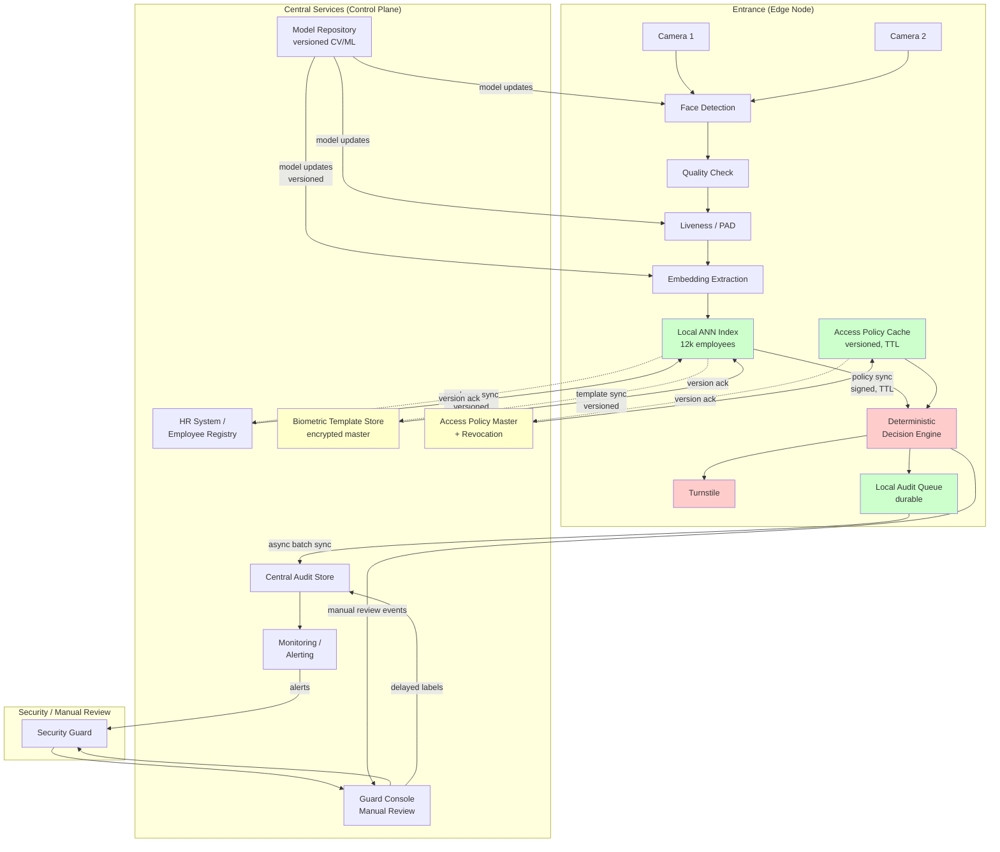

# Архитектура системы биометрического контроля доступа

## 1. Контекст

**Задача:** распознавание лица для автоматического открытия турникета.

**Масштаб:** 12 000 сотрудников, 3 входа (2 камеры/вход), 19 000 проходов/день, пик 20 проходов/мин/вход.

**Требования:** ML decision latency target ≤1 с, 0 подтверждённых false accepts (pilot), FRR ≤3% pilot target, offline resilience, fail-safe.

**Принцип безопасности:** физический доступ определяется детерминированной логикой. LLM не находится в критическом пути allow/deny.

## 2. Edge-first Hybrid Architecture

**Выбор:** edge-first hybrid — синхронный hot path на edge, асинхронный control plane центрально.

**Обоснование:**
- Target ML decision latency ≤1 с требует минимизации WAN
- Offline/degraded operation обязательна
- Central services — control plane (registry, policy, updates, audit), не hot-path dependency

**Edge node:** detection → decision → turnstile command, локальный кэш (ANN index, access policy), durable audit queue, автономия в пределах policy freshness window.

**Central services:** employee registry, biometric template store, access policy + revocation, model/version distribution, central audit, monitoring, manual review backend.

## 3. Синхронный Hot Path (Edge)

```
camera → detection → quality → alignment → liveness/PAD
  → embedding → ANN identification (local 1:N) → policy lookup (cached)
  → deterministic decision → idempotent turnstile command → local audit
```

**Target latency budget (design, не измерено):** detection ~150 ms, PAD ~100 ms, embedding ~150 ms, ANN ~30 ms, policy <5 ms, decision <5 ms, command ~30 ms. Total ~465 ms + reserve → <1 s target. Реальная latency измеряется в pilot.

## 4. Идемпотентность и Command Handling

- **event_id:** идентифицирует событие доступа (camera, timestamp, sequence)
- **decision_id:** идентифицирует детерминированное решение для event
- **command_id:** идентифицирует физическую команду турникету

**Retry logic:**
- Повторные попытки одной команды используют тот же `command_id`
- Turnstile adapter возвращает previous result/NOOP для уже applied command
- ACK/NACK handling explicit
- Durable bounded deduplication state, retention покрывает operational retry/replay horizon (parameter, не invented requirement)

## 5. Версионированные Snapshots и Consistency

Каждое решение использует **один internally consistent immutable snapshot**:
- Template/ANN index version
- Access policy version
- Revocation watermark

**Процесс:**
- Acquire read snapshot в начале decision
- Updates validated и atomically swapped
- Никогда не комбинировать старый ANN с несовместимой новой policy
- Если consistency не установлена → degraded state → no biometric auto-allow

**Update distribution:**
- Signed versioned snapshots
- Incremental diffs с validation
- Revocation high-priority push
- Edge ack версии
- Atomic index swap (no partial state)

## 6. Offline и Policy Freshness

**Policy cache states:**

| State | Condition | Biometric Auto-Allow |
|-------|-----------|---------------------|
| **FRESH** | age < policy_freshness_threshold | ✅ May proceed if all gates pass |
| **STALE/UNKNOWN** | age ≥ threshold OR network never reached | ❌ NO auto-allow |

**Конкретный threshold** — operational configuration parameter, validated с security/operations. Не изобретаем 60/240-min как facts.

**Сценарий E-1005 (offline + potentially missed revocation):**
- Network offline
- Policy cache STALE
- Employee мог быть revoked
- Biometric decision: **NO auto-allow** → CLOSED
- Safe fallback: manual process, card (если available), guard review

**Recovery:** при восстановлении WAN edge запрашивает fresh snapshot, validates, атомарно активирует.

## 7. Таблица Решений

| Условие | Решение | Турникет | Примечание |
|---------|---------|----------|------------|
| Quality + liveness + strong unique match + FRESH valid policy | **ALLOW** | **OPEN** | Единственный путь к auto-open |
| Low quality / technical issue | **RETRY** | CLOSED | Подсказка «повторите» |
| Liveness uncertain / PAD fail | **RETRY** or **DENY** | CLOSED | Uncertain → retry; suspected spoof → deny |
| Borderline match / low margin | **MANUAL_REVIEW** | CLOSED | Guard проверяет |
| Revoked access | **DENY** | CLOSED | Security log |
| STALE/UNKNOWN policy | **NO auto-allow** | CLOSED | Degraded: safe fallback/manual |
| Duplicate command_id | **NOOP** | Previous result | Идемпотентность |

## 8. Инварианты Безопасности

- **INV-1:** `spoof_suspected` ⇒ турникет never opens
- **INV-2:** `decision == MANUAL_REVIEW` ⇒ CLOSED (ожидание guard)
- **INV-3:** `revoked == true` ⇒ never allow
- **INV-4:** `policy_state == STALE || UNKNOWN` ⇒ no biometric auto-allow
- **INV-5:** `duplicate(command_id)` ⇒ idempotent (no repeat open)
- **INV-6:** `OPEN command` только при `decision == ALLOW AND all_gates_passed`

## 9. Audit

Каждое решение записывает: event_id, timestamp, gate/camera, model/ANN/policy versions, quality/liveness/match scores, decision/reasons, degraded_mode, command_id, side_effect_result, latency_breakdown.

**Offline resilience:** durable local queue, async batch sync после recovery. Disk full → alert, biometric disabled.

## 10. Privacy и Biometric Storage

- Сырые кадры **не сохраняются по умолчанию** после обработки
- Central master: encrypted, access-controlled
- Edge: subset templates для site + version metadata
- Incident image retention (если enabled): separate short-retention policy, security/legal approval required

Конкретные retention periods определяются legal/compliance, не system design.

## 11. Manual Review Capacity

**Pilot guardrail:** ≤1% проходов → manual review.

**Capacity math (simultaneous peak):**
- 3 entrances × 20 passages/min = 60 passages/min
- 1% = 0.6 review cases/min
- ~4 min/case ⇒ ~2.4 reviewer-minutes/min average across campus

**Не заявляем inherently safe/manageable.** Reviewer capacity must be validated в pilot. Growing queue ⇒ stronger retry/card fallback, rollback to assisted mode.

## 12. Confirmed False Accept Definition

**Confirmed false accept:** unauthorized passage confirmed by security investigation using audit trail, access-rights state, and whatever supporting evidence is legitimately available (не предполагаем mandatory video retention).

## 13. MVP vs Target

**MVP:** deterministic decision engine, mock CV/embedding/liveness, synthetic events, local audit, happy+risky paths, simulated turnstile. Цель: architecture pattern + safety invariants.

**Target:** pretrained CV stack, hardened edge, production ANN (12k), secure updates, real integration, guard console, monitoring.

## 14. Architecture Diagram



**Легенда:** Красный = критический путь; Зелёный = локальное edge состояние; Жёлтый = sensitive central state; Сплошные = sync; Пунктир = async.

## 15. Ключевые Решения

1. **Edge-first hybrid:** latency + offline resilience
2. **Deterministic decision, no LLM:** safety + audit
3. **Binary policy freshness:** FRESH (allow) / STALE (no auto-allow), no degraded-auto-allow middle state
4. **Versioned consistent snapshots:** atomic updates, no partial state mixing
5. **Idempotent commands:** durable deduplication, ACK/NACK handling
6. **Fail-closed:** uncertain identity/spoof/revoked/stale → CLOSED
7. **Local durable audit:** offline resilience
8. **Privacy-minimizing:** no default raw frame retention
