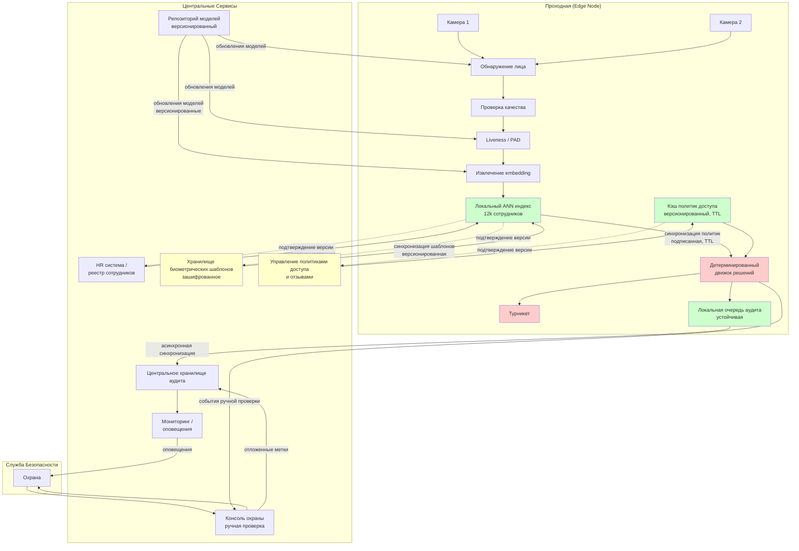

# Архитектура системы биометрического контроля доступа

## 1. Контекст

**Задача:** распознавание лица для автоматического открытия турникета.

**Масштаб:** 12 000 сотрудников, 3 входа (2 камеры на вход), 19 000 проходов в день, пик 20 проходов в минуту на вход.

**Требования:** целевая задержка ML-решения ≤1 с, 0 подтверждённых false accepts (пилот), целевая FRR ≤3% для пилота, работа в автономном режиме, безопасный отказ.

**Принцип безопасности:** физический доступ определяется детерминированной логикой. LLM не участвует в принятии решения ALLOW/DENY.

## 2. Гибридная Архитектура с Приоритетом Edge

**Выбор:** критический синхронный путь выполняется на edge, асинхронный управляющий контур — централизованно.

**Обоснование:**
- Целевая задержка ML-решения ≤1 с требует минимизации обращений по WAN
- Работа в автономном режиме и при деградации обязательна
- Центральные сервисы — управляющий контур (реестр, политики, обновления, аудит), а не обязательная зависимость на критическом пути

**Узел Edge:** обнаружение → решение → команда турникету, локальный кэш (ANN индекс, политики доступа), устойчивая очередь аудита, автономность в пределах актуальности политик.

**Центральные сервисы:** реестр сотрудников, хранилище биометрических шаблонов, управление политиками доступа и отзывами, распространение моделей и версий, центральный аудит, мониторинг, backend ручной проверки.

## 3. Критический Синхронный Путь (Edge)

```
камера → обнаружение → проверка качества → выравнивание → liveness/PAD
  → извлечение embedding → ANN идентификация (локально 1:N) → проверка политики (кэш)
  → детерминированное решение → идемпотентная команда турникету → локальный аудит
```

**Целевой бюджет задержки (проектный, не измерен):** обнаружение ~150 ms, PAD ~100 ms, embedding ~150 ms, ANN ~30 ms, политика <5 ms, решение <5 ms, команда ~30 ms. Всего ~465 ms + резерв → целевая <1 с. Реальная задержка измеряется в пилоте.

## 4. Идемпотентность и Обработка Команд

- **event_id:** идентифицирует событие доступа
- **decision_id:** идентифицирует детерминированное решение для события
- **command_id:** идентифицирует физическую команду турникету

**Логика повторных попыток:**
- Повторные попытки одной команды используют тот же command_id
- Адаптер турникета возвращает предыдущий результат или NOOP для уже применённой команды
- Явная обработка ACK/NACK
- Устойчивое состояние дедупликации с retention, покрывающим операционный горизонт повторов (параметр, а не изобретённое требование)

## 5. Версионированные Согласованные Снимки Состояния

Каждое решение использует **один внутренне согласованный неизменяемый снимок состояния**:
- Версия шаблонов и ANN индекса
- Версия политик доступа
- Метка отзывов (revocation watermark)

**Процесс:**
- Фиксируется снимок для чтения в начале принятия решения
- Обновления валидируются и атомарно переключаются
- Никогда не комбинировать старый ANN с несовместимой новой политикой
- Если согласованность не установлена → режим деградации → автоматический биометрический допуск запрещён

**Распространение обновлений:**
- Подписанные версионированные снимки
- Инкрементальные дельты с валидацией
- Отзывы передаются с высшим приоритетом
- Edge подтверждает получение версии
- Атомарное переключение индекса (без частичного состояния)

## 6. Автономная Работа и Актуальность Политик

**Состояния кэша политик:**

| Состояние | Условие | Автоматический биометрический допуск |
|-----------|---------|--------------------------------------|
| **FRESH** | возраст < порог актуальности | ✅ Разрешён если все проверки пройдены |
| **STALE/UNKNOWN** | возраст ≥ порог ИЛИ сеть никогда не достигнута | ❌ Запрещён |

**Конкретный порог** — операционный конфигурационный параметр, валидируется со службой безопасности и операциями. Не изобретаем 60/240 мин как факты.

**Сценарий E-1005 (автономный режим + потенциально пропущенный отзыв):**
- Сеть недоступна
- Кэш политик в состоянии STALE
- Сотрудник мог быть отозван
- Биометрическое решение: **автоматический допуск запрещён** → турникет **CLOSED**
- Безопасный резервный вариант: ручная проверка, проход по карте (если доступна)

**Восстановление:** при восстановлении связи edge запрашивает свежий снимок, валидирует, атомарно активирует.

## 7. Таблица Решений

| Условие | Решение | Турникет | Примечание |
|---------|---------|----------|------------|
| Качество + liveness + сильное уникальное совпадение + FRESH валидная политика | **ALLOW** | **OPEN** | Единственный путь к автоматическому открытию |
| Низкое качество или техническая проблема | **DENY** | CLOSED | Следующее действие: повтор кадра или карта |
| Liveness неопределён | **MANUAL_REVIEW** | CLOSED | Неопределённость не даёт автоматический допуск |
| Подозрение на спуфинг / PAD attack | **DENY** | CLOSED | Разбор службой безопасности |
| Пограничное совпадение или низкий margin | **MANUAL_REVIEW** | CLOSED | Проверка охраной |
| Доступ отозван | **DENY** | CLOSED | Лог безопасности |
| Политика в состоянии STALE/UNKNOWN | **Допуск запрещён** | CLOSED | Режим деградации: безопасный резервный вариант или ручная проверка |
| Дубликат command_id | **NOOP** | Предыдущий результат | Идемпотентность |

## 8. Инварианты Безопасности

- **INV-1:** подозрение на спуфинг ⇒ турникет никогда не открывается
- **INV-2:** решение MANUAL_REVIEW ⇒ CLOSED (ожидание охраны)
- **INV-3:** доступ отозван ⇒ никогда не ALLOW
- **INV-4:** политика в состоянии STALE или UNKNOWN ⇒ автоматический биометрический допуск запрещён
- **INV-5:** дубликат command_id ⇒ идемпотентный (без повторного открытия)
- **INV-6:** команда OPEN только при ALLOW и прохождении всех проверок

## 9. Аудит

PoC записывает: event_id, временную метку, проходную/камеру, версии модели/ANN/политики, состояния quality/liveness/match, решение и причины, режим деградации, command_id и результат команды. Целевая audit-схема дополнительно хранит breakdown задержки компонентов.

**Устойчивость в автономном режиме:** устойчивая локальная очередь, асинхронная пакетная синхронизация после восстановления. Диск заполнен → оповещение, биометрия отключена.

## 10. Конфиденциальность и Хранение Биометрии

- Сырые кадры **не сохраняются по умолчанию** после обработки
- Центральное хранилище: зашифровано, контроль доступа
- Edge: подмножество шаблонов для площадки + метаданные версии
- Сохранение изображений инцидентов (если включено): отдельная политика краткосрочного хранения, требует одобрения службы безопасности и юристов

Конкретные периоды хранения определяются юридическим отделом и комплаенсом, а не системным дизайном.

## 11. Пропускная Способность Ручной Проверки

**Граница пилота:** ≤1% проходов направляется на ручную проверку.

**Расчёт пропускной способности (одновременный пик):**
- 3 входа × 20 проходов в минуту = 60 проходов в минуту
- 1% = 0.6 случаев ручной проверки в минуту
- ~4 мин на случай ⇒ ~2.4 минуты работы сотрудников охраны в минуту в среднем по кампусу

**Не заявляем, что это безопасно или управляемо по умолчанию.** Пропускная способность сотрудников охраны должна быть проверена в пилоте. Растущая очередь ⇒ усиление повторов и проходов по карте, откат в assisted mode.

## 12. Определение Подтверждённого False Accept

**Подтверждённый false accept:** неавторизованный проход, подтверждённый расследованием службы безопасности с использованием трейла аудита, состояния прав доступа и любых доступных подтверждающих свидетельств (не предполагаем обязательное сохранение видео).

## 13. MVP vs Целевая Система

**MVP:** детерминированный движок решений, заглушки CV/embedding/liveness, синтетические события, локальный аудит, сценарии успеха и риска, симуляция турникета. Цель: архитектурный паттерн + инварианты безопасности.

**Целевая система:** предобученный CV стек, защищённый edge, production ANN (12k), безопасные обновления, реальная интеграция, консоль охраны, мониторинг.

## 14. Диаграмма Архитектуры



**Легенда:** Красный = критический путь; Зелёный = локальное состояние edge; Жёлтый = чувствительное центральное состояние; Сплошные линии = синхронные; Пунктир = асинхронные.

## 15. Ключевые Решения

1. **Гибрид с приоритетом edge:** минимальная задержка + устойчивость в автономном режиме
2. **Детерминированные решения, без LLM:** безопасность + аудит
3. **Бинарная актуальность политик:** FRESH (допуск разрешён) или STALE (допуск запрещён), без промежуточного состояния
4. **Версионированные согласованные снимки:** атомарные обновления, без смешивания частичных состояний
5. **Идемпотентные команды:** устойчивая дедупликация, обработка ACK/NACK
6. **Безопасный отказ:** неопределённая личность, спуфинг, отозван, устаревшие политики → CLOSED
7. **Локальный устойчивый аудит:** работа в автономном режиме
8. **Минимизация раскрытия данных:** без сохранения сырых кадров по умолчанию
